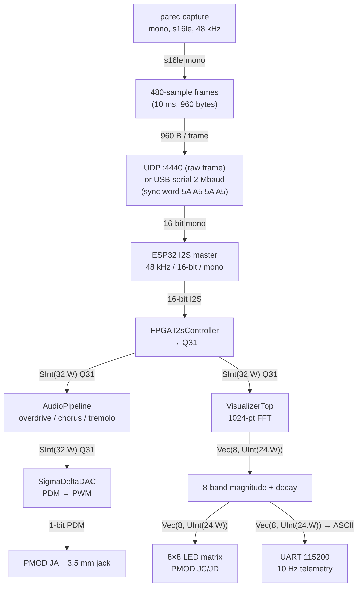

# Data flow

> DRAFT — kept separate from `docs/` pending approval. Merge into `docs/data-flow.md` only if confirmed.

```mermaid
flowchart TD
  A["parec capture<br/>mono, s16le, 48 kHz"] -- "s16le mono" --> B["480-sample frames<br/>(10 ms, 960 bytes)"]
  B -- "960 B / frame" --> C["UDP :4440 (raw frame)<br/>or USB serial 2 Mbaud<br/>(sync word 5A A5 5A A5)"]
  C -- "16-bit mono" --> D["ESP32 I2S master<br/>48 kHz / 16-bit / mono"]
  D -- "16-bit I2S" --> E["FPGA I2sController<br/>→ Q31"]
  E -- "SInt(32.W) Q31" --> F["AudioPipeline<br/>overdrive / chorus / tremolo"]
  E -- "SInt(32.W) Q31" --> G["VisualizerTop<br/>1024-pt FFT"]
  F -- "SInt(32.W) Q31" --> H["SigmaDeltaDAC<br/>PDM → PWM"]
  G -- "Vec(8, UInt(24.W))" --> I["8-band magnitude + decay"]
  H -- "1-bit PDM" --> J["PMOD JA + 3.5 mm jack"]
  I -- "Vec(8, UInt(24.W))" --> K["8×8 LED matrix<br/>PMOD JC/JD"]
  I -- "Vec(8, UInt(24.W)) → ASCII" --> L["UART 115200<br/>10 Hz telemetry"]
```
