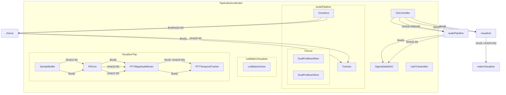

# FPGA design (deterministic)

> Auto-generated from the Chisel sources by `generate_fpga_diagram.py`.
> Do not edit by hand; re-run the script to regenerate.

```mermaid
flowchart TB
subgraph S_TopAudioAccelerator["TopAudioAccelerator"]
    subgraph S_audioPipeline["AudioPipeline"]
        subgraph S_chorus["Chorus"]
            delayBufferRam["DualPortBramRam"]
            sineTableRom["DualPortBramRom"]
        end
        overdrive["Overdrive"]
        tremolo["Tremolo"]
    end
    dac["SigmaDeltaDAC"]
    i2sController["I2sController"]
    subgraph S_matrixVisualizer["LedMatrixVisualizer"]
        driver["LedMatrixDriver"]
    end
    uartTransmitter["UartTransmitter"]
    subgraph S_visualizer["VisualizerTop"]
        binner["FFTMagnitudeBinner"]
        buffer["SampleBuffer"]
        fft["FftCore"]
        tracker["FFTTemporalTracker"]
    end
end
audioPipeline -- "Bool()" --> dac
audioPipeline -- "SInt(32.W)" --> dac
binner -- "Vec(8, UInt(24.W))" --> tracker
binner -- "Bool()" --> tracker
buffer -- "SInt(12.W)" --> fft
buffer -- "Bool()" --> fft
chorus -- "Bool()" --> tremolo
chorus -- "SInt(32.W)" --> tremolo
fft -- "Bool()" --> binner
fft -- "UInt(12.W)" --> binner
fft -- "UInt(12.W)" --> binner
i2sController -- "SInt(32.W)" --> audioPipeline
i2sController -- "SInt(32.W)" --> visualizer
i2sController -- "Bool()" --> audioPipeline
i2sController -- "Bool()" --> visualizer
overdrive -- "Bool()" --> chorus
overdrive -- "SInt(32.W)" --> chorus
visualizer -- "Vec(8, UInt(24.W))" --> matrixVisualizer
```
