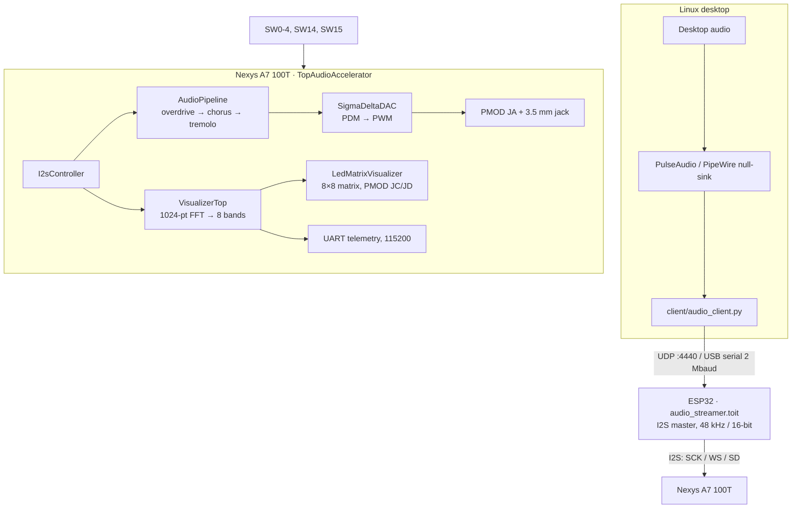

# System overview

> DRAFT — kept separate from `docs/` pending approval. Merge into `docs/architecture.md` only if confirmed.

```mermaid
flowchart TB
  subgraph PC["Linux desktop"]
    AUDIO["Desktop audio"] --> PA["PulseAudio / PipeWire null-sink"]
    PA --> CLIENT["client/audio_client.py"]
  end

  CLIENT -- "UDP :4440 / USB serial 2 Mbaud" --> BRIDGE["ESP32 · audio_streamer.toit<br/>I2S master, 48 kHz / 16-bit"]

  BRIDGE -- "I2S: SCK / WS / SD" --> FPGA["Nexys A7 100T"]

  subgraph FPGA2["Nexys A7 100T · TopAudioAccelerator"]
    I2S["I2sController"] --> FX["AudioPipeline<br/>overdrive → chorus → tremolo"]
    FX --> DAC["SigmaDeltaDAC<br/>PDM → PWM"]
    DAC --> OUT["PMOD JA + 3.5 mm jack"]
    I2S --> VIZ["VisualizerTop<br/>1024-pt FFT → 8 bands"]
    VIZ --> MATRIX["LedMatrixVisualizer<br/>8×8 matrix, PMOD JC/JD"]
    VIZ --> UART["UART telemetry, 115200"]
  end

  SW["SW0-4, SW14, SW15"] --> FPGA2
```
